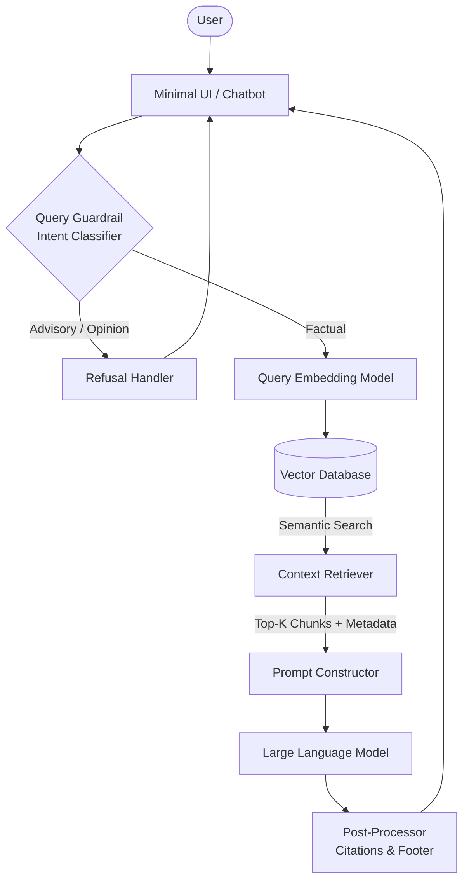

# Architecture Document: Mutual Fund FAQ Assistant (Facts-Only Q&A)

This document outlines the detailed architecture for the Retrieval-Augmented Generation (RAG)-based Mutual Fund FAQ Assistant, aligned with the strict "facts-only" problem statement.

---

## 1. High-Level System Architecture

The architecture follows a standard RAG pipeline but introduces a strict **Query Guardrail** to enforce the refusal of advisory queries before they reach the retrieval or generation stage.

---

## 2. Core Components

### 2.1. Data Ingestion & Processing Pipeline
Since the corpus is strictly limited to a predefined set of 10 Groww URLs, the ingestion pipeline can be run periodically (e.g., daily or weekly) rather than in real-time. **Important Note: The system will exclusively scrape and process the textual content from these HTML pages. No PDFs (such as KIM or SID documents) or other external sources will be ingested.**

*   **Web Scraper**: Extracts textual HTML content directly from the 10 defined URLs (using tools like `BeautifulSoup` or `Playwright`).
*   **Text Cleaner**: Removes HTML tags, boilerplate navigation, and irrelevant sidebars to isolate factual scheme data.
*   **Chunking Strategy**: Uses a `RecursiveCharacterTextSplitter` (e.g., chunk size of 500-1000 tokens) with overlap to ensure context isn't lost across chunk boundaries.
*   **Metadata Tagging**: **Crucial step**. Every chunk must be tagged with its `source_url` and `last_updated_date`.

### 2.2. Vector Storage
*   **Embedding Model**: Converts chunks into vector representations using a BGE model (e.g., `BAAI/bge-small-en`).
*   **Vector Database**: A lightweight database (e.g., `ChromaDB`, `FAISS`, or `Qdrant`) stores the embeddings alongside their metadata.

### 2.3. Query Processing & Guardrails (The "Facts-Only" Enforcer)
Before executing a search, the system must determine if the query is safe.
*   **Intent Classifier**: A lightweight LLM call or a fast classification model that categorizes the user's prompt as either `FACTUAL` (e.g., "What is the exit load?") or `ADVISORY` (e.g., "Should I buy this?").
*   **Refusal Handler**: If classified as `ADVISORY`, the system bypasses RAG entirely and returns a hardcoded, polite refusal message along with a link to an educational resource like SEBI/AMFI.

### 2.4. RAG Core (Retrieval & Generation)
*   **Retriever**: Converts the factual query into an embedding and performs a similarity search against the Vector DB, returning the top-K most relevant chunks.
*   **Prompt Construction**: Injects the retrieved chunks into a strict system prompt. 
    *   *System Prompt Rules:* "You are a factual assistant. Answer strictly using the provided context. Do not offer advice. Your answer must not exceed 3 sentences. If the answer is not in the context, state that you do not know."
*   **LLM (Generator)**: Generates the answer based on the prompt constraints (using Groq for ultra-low latency inference, e.g., Llama 3).

### 2.5. Post-Processing (Citation & Formatting)
To meet compliance constraints, the output from the LLM must be formatted before reaching the user.
*   **Citation Extraction**: The system looks at the metadata of the specific chunk(s) the LLM used to generate the answer.
*   **Footer Appender**: Appends the mandatory single source link and the footer to the LLM's raw output.
    *   *Format:* `\n\nSource: <URL>\nLast updated from sources: <Date>`

### 2.6. User Interface (UI)
A minimal, lightweight frontend interface.
*   **Disclaimer**: Prominently displays *"Facts-only. No investment advice."*
*   **Examples**: Provides 3 clickable example questions (e.g., "What is the minimum SIP for HDFC Flexi Cap?").
*   **Privacy**: Does not request or store any PII (no login, no PAN, no email).

---

## 3. Recommended Technology Stack

| Component | Recommended Technology | Justification |
| :--- | :--- | :--- |
| **Language** | Python | Standard for AI/RAG data pipelines. |
| **Orchestration** | LangChain or LlamaIndex | Built-in tools for document loaders, splitters, and vector store integrations. |
| **Web Scraping** | BeautifulSoup / requests | Simple and effective for static text extraction. |
| **Vector Database** | ChromaDB (Local) | Extremely lightweight, requires no external infrastructure, perfect for a 10-URL corpus. |
| **Embeddings** | BGE Model (e.g., `BAAI/bge-small-en`) | Open-source, fast, and highly accurate semantic search capabilities. |
| **LLM Engine** | Groq (e.g., Llama 3) | Ultra-low latency inference, highly cost-effective, and excellent at following strict negative constraints. |
| **Frontend UI** | Streamlit | Rapid prototyping, built-in chat UI components, minimal setup. |

---

## 4. Addressing System Constraints

*   **Constraint: Max 3 Sentences:** Enforced strictly via the LLM System Prompt.
*   **Constraint: Exact Citation:** Enforced by the Post-Processor extracting metadata, not by the LLM trying to hallucinate a URL.
*   **Constraint: No PII Storage:** The Streamlit app is stateless. Conversation history can be maintained in-memory for follow-up questions but is dropped when the session ends. No external databases are used for user logs.
